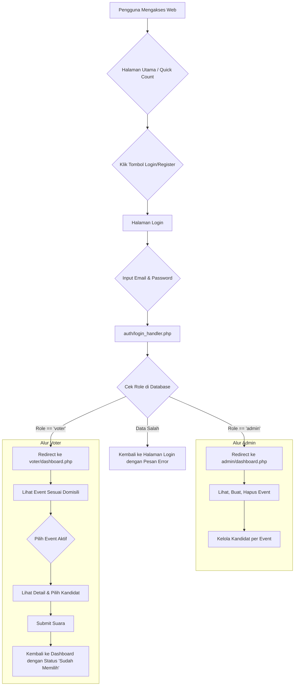

# 💻 Sistem E-Voting Berbasis Web


Selamat datang di dokumentasi resmi Proyek E-Voting. Proyek ini adalah sebuah platform berbasis web yang dirancang untuk memfasilitasi proses pemilihan umum secara digital, mulai dari manajemen event oleh admin hingga proses pemberian suara oleh para pemilih (voter).

---
## ✨ Fitur Utama

* **Dua Peran Pengguna:** Sistem membedakan akses dan fungsionalitas antara **Admin** dan **Voter**.
* **Manajemen Event Dinamis:** Admin dapat membuat, mengedit, dan menghapus event pemilihan (misal: Pilpres, Pilgub) secara penuh.
* **Manajemen Kandidat Lengkap:** Admin dapat menambah, mengedit, dan menghapus kandidat lengkap dengan nomor urut, partai, dan foto untuk setiap event.
* **Input Data Terstandardisasi:** Penggunaan dropdown untuk isian krusial seperti domisili, posisi jabatan, dan wilayah pemilihan untuk menjaga konsistensi data.
* **Dashboard Voter Terpersonalisasi:** Voter hanya akan melihat event pemilihan yang relevan dengan domisili mereka atau yang berskala nasional.
* **Sistem Voting Aman:** Mekanisme "satu orang, satu suara" per event dijamin melalui validasi di level database.
* **Quick Count Real-time:** Halaman utama menampilkan hasil hitung cepat yang dapat diakses oleh publik dan diperbarui secara otomatis.
* **Keamanan Konfirmasi:** Admin harus mengetik ulang nama event sebelum menghapusnya untuk mencegah kesalahan.

---
## 🚀 Teknologi yang Digunakan

| Teknologi      | Deskripsi                                                                                                                  |
| :------------- | :------------------------------------------------------------------------------------------------------------------------- |
| **PHP** | Bahasa pemrograman utama di sisi server untuk mengelola semua logika bisnis.                                               |
| **MySQL** | Sistem manajemen database untuk menyimpan semua data (pengguna, event, kandidat, suara).                                   |
| **HTML5** | Struktur dasar untuk semua halaman web.                                                                                    |
| **Tailwind CSS** | Framework CSS untuk membangun antarmuka yang modern dan responsif dengan cepat.                                            |
| **JavaScript** | Digunakan untuk interaktivitas di sisi klien, seperti validasi modal dan pembaruan data *quick count* secara asinkron (AJAX). |

---
## 📂 Struktur Proyek

Berikut adalah struktur folder final dari proyek ini untuk memastikan kode tetap terorganisir.

```
/proyek-evoting/
├── admin/
│   ├── dashboard.php
│   ├── event_create.php
│   ├── event_create_handler.php
│   ├── event_delete_handler.php
│   ├── manage_candidates.php
│   ├── candidate_add_handler.php
│   └── candidate_delete_handler.php
│
├── voter/
│   ├── dashboard.php
│   ├── event_detail.php
│   └── submit_vote.php
│
├── api/
│   └── quick_count.php
│
├── auth/
│   ├── login.php
│   ├── login_handler.php
│   ├── register.php
│   ├── register_handler.php
│   └── logout.php
│
├── config/
│   └── database.php
│
├── assets/
│   ├── css/
│   ├── js/
│   └── images/
│
└── index.php
```

---
## 📊 Alur Kerja Program (Flowchart)

Flowchart ini menggambarkan alur yang dialami oleh pengguna, mulai dari halaman utama hingga ke dashboard masing-masing peran.



---
## 🗄️ Skema Database

<details>
<summary><strong>Klik untuk melihat Skema SQL Lengkap</strong></summary>

```sql
-- Database: `db_evoting`

CREATE TABLE `users` (
  `id` INT AUTO_INCREMENT PRIMARY KEY,
  `nama_lengkap` VARCHAR(255) NOT NULL,
  `email` VARCHAR(255) NOT NULL UNIQUE,
  `password` VARCHAR(255) NOT NULL,
  `domisili` VARCHAR(100) NOT NULL,
  `role` ENUM('admin', 'voter') NOT NULL,
  `created_at` TIMESTAMP DEFAULT CURRENT_TIMESTAMP
);

CREATE TABLE `events` (
  `id` INT AUTO_INCREMENT PRIMARY KEY,
  `nama_event` VARCHAR(255) NOT NULL UNIQUE,
  `posisi_jabatan` VARCHAR(255) NOT NULL,
  `wilayah` VARCHAR(100) NOT NULL,
  `deskripsi` TEXT,
  `waktu_mulai` DATETIME NOT NULL,
  `waktu_selesai` DATETIME NOT NULL,
  `created_by` INT,
  `created_at` TIMESTAMP DEFAULT CURRENT_TIMESTAMP,
  FOREIGN KEY (`created_by`) REFERENCES `users`(`id`)
);

CREATE TABLE `candidates` (
  `id` INT AUTO_INCREMENT PRIMARY KEY,
  `event_id` INT NOT NULL,
  `nama_kandidat` VARCHAR(255) NOT NULL,
  `partai_asal` VARCHAR(100),
  `nomor_urut` INT NOT NULL,
  `foto_kandidat` VARCHAR(255),
  `visi_misi` TEXT,
  FOREIGN KEY (`event_id`) REFERENCES `events`(`id`) ON DELETE CASCADE
);

CREATE TABLE `votes` (
  `id` INT AUTO_INCREMENT PRIMARY KEY,
  `event_id` INT NOT NULL,
  `candidate_id` INT NOT NULL,
  `voter_id` INT NOT NULL,
  `voted_at` TIMESTAMP DEFAULT CURRENT_TIMESTAMP,
  UNIQUE KEY `unique_vote` (`event_id`, `voter_id`),
  FOREIGN KEY (`event_id`) REFERENCES `events`(`id`) ON DELETE CASCADE,
  FOREIGN KEY (`candidate_id`) REFERENCES `candidates`(`id`) ON DELETE CASCADE,
  FOREIGN KEY (`voter_id`) REFERENCES `users`(`id`) ON DELETE CASCADE
);
```

</details>

---
## 🛠️ Instalasi & Setup Lokal

Ikuti langkah-langkah ini untuk menjalankan proyek di lingkungan lokal menggunakan XAMPP.

1.  **Prasyarat**:
    * Pastikan **XAMPP** sudah terinstal dan service **Apache** & **MySQL** berjalan.

2.  **Salin Proyek**:
    * Letakkan seluruh folder `proyek-evoting` ke dalam direktori `C:\xampp\htdocs\` (atau lokasi htdocs Anda).

3.  **Setup Database**:
    * Buka browser dan akses `http://localhost/phpmyadmin`.
    * Buat database baru dengan nama `db_evoting`.
    * Pilih database `db_evoting`, buka tab **SQL**, dan jalankan seluruh skrip dari [Skema Database](#-skema-database) di atas.

4.  **Konfigurasi Koneksi**:
    * Buka file `config/database.php`.
    * Pastikan konfigurasi (`$db_host`, `$db_user`, `$db_pass`, `$db_name`) sudah sesuai dengan pengaturan XAMPP Anda (biasanya pengaturan default sudah benar).

5.  **Buat User Admin Pertama**:
    * Untuk bisa login sebagai admin, jalankan perintah SQL berikut di phpMyAdmin pada tabel `users`. **PENTING**: Ganti `'password_aman'` dengan password pilihan Anda.
    * Pertama, buat hash password. Buat file `generate_hash.php` sementara di folder `auth/` dengan isi:
        ```php
        <?php echo password_hash('password_aman', PASSWORD_DEFAULT); ?>
        ```
    * Akses `http://localhost/proyek-evoting/auth/generate_hash.php`. Salin output hash yang muncul.
    * Jalankan query SQL ini di phpMyAdmin (ganti bagian hash dengan hasil yang Anda salin):
        ```sql
        INSERT INTO `users` (`nama_lengkap`, `email`, `password`, `domisili`, `role`)
        VALUES ('Administrator', 'admin@evoting.com', 'PASTE_HASH_ANDA_DI_SINI', 'Nasional', 'admin');
        ```

6.  **Jalankan Proyek**:
    * Buka browser dan akses `http://localhost/proyek-evoting/`.
    * Anda akan melihat halaman utama. Silakan login menggunakan akun admin yang baru dibuat.

---
## 🔑 Peran & Fungsionalitas

* **Publik (Tanpa Login)**
    * Mengakses halaman utama (`index.php`).
    * Melihat hasil hitung cepat (*quick count*) dari semua event yang sedang berlangsung atau baru saja selesai.

* **Voter**
    * Mendaftar dan login ke sistem.
    * Melihat daftar event yang tersedia berdasarkan domisili atau skala nasional.
    * Melihat status event (Akan Datang, Berlangsung, Selesai).
    * Melihat status pribadi (Sudah Memilih / Belum Memilih).
    * Masuk ke halaman detail event untuk melihat daftar kandidat.
    * Memberikan satu suara untuk satu kandidat pada event yang sedang berlangsung.

* **Admin**
    * Memiliki semua hak akses Voter.
    * Mengakses dashboard admin khusus.
    * **CRUD Event:** Membuat, Melihat, Mengedit, dan Menghapus event pemilihan.
    * **CRUD Kandidat:** Menambah, Mengedit, dan Menghapus kandidat untuk setiap event.
